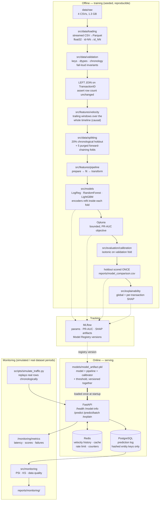

# Production Fraud Detection & ML Decision Platform

End-to-end fraud detection system on the [IEEE-CIS Fraud Detection](https://www.kaggle.com/c/ieee-fraud-detection)
dataset: a reproducible data pipeline, leakage-safe temporal validation, model
comparison, SHAP explainability, MLflow tracking with a model registry, a FastAPI
scoring service with Redis-backed online velocity features, PostgreSQL prediction
logging, Docker Compose orchestration, drift monitoring, tests and CI.

> **Every number in this README was measured by code in this repository.** The
> audit figures come from `scripts/inspect_dataset.py`, the model metrics from
> `scripts/train.py` (recorded in MLflow and `reports/model_comparison.csv`), and
> the drift figures from `scripts/monitor.py`. Nothing is estimated or carried
> over from published leaderboards. Where a component is a demonstration rather
> than production reality — the monitoring traffic, for instance — it says so.

---

## Table of contents

1. [Problem statement](#1-problem-statement)
2. [Why fraud detection is a hard ML problem](#2-why-fraud-detection-is-a-hard-ml-problem)
3. [Dataset](#3-dataset)
4. [Architecture](#4-architecture)
5. [Data pipeline](#5-data-pipeline)
6. [Leakage prevention and validation design](#6-leakage-prevention-and-validation-design)
7. [Feature engineering](#7-feature-engineering)
8. [Model comparison](#8-model-comparison)
9. [Final metrics](#9-final-metrics)
10. [SHAP explainability](#10-shap-explainability)
11. [MLflow](#11-mlflow)
12. [FastAPI service](#12-fastapi-service)
13. [PostgreSQL](#13-postgresql)
14. [Redis](#14-redis)
15. [Docker](#15-docker)
16. [Monitoring](#16-monitoring)
17. [Testing](#17-testing)
18. [CI/CD](#18-cicd)
19. [How to run locally](#19-how-to-run-locally)
20. [API examples](#20-api-examples)
21. [Limitations](#21-limitations)
22. [Future improvements](#22-future-improvements)

---

## 1. Problem statement

Given a card-not-present transaction, return a calibrated fraud probability fast
enough to sit inside an authorisation flow, together with the reasons behind the
score.

The real constraint is not accuracy, it is the **asymmetry of costs**. Missing
fraud means a chargeback; flagging a legitimate transaction means a declined
customer, and at 3.5% prevalence there are 27.58 legitimate transactions for
every fraudulent one — so even a small false-positive rate produces an alert
queue no review team can clear. The system is therefore built around *ranking
quality at low alert volume* and *calibrated probabilities*, not around a
single accuracy figure.

## 2. Why fraud detection is a hard ML problem

Four properties of this problem shaped nearly every design decision here:

**Extreme imbalance.** 3.4993% positives. A model that predicts "never fraud"
achieves **96.5007% accuracy**, so accuracy cannot distinguish a useful model
from a constant. It is reported nowhere in this project.

**Non-stationarity.** Fraud is adversarial: tactics change in response to
defences. Measured in this dataset, fraud prevalence moves between 2.4762% and
4.1795% across 30-day blocks. Any validation scheme assuming a fixed
distribution is measuring the wrong thing.

**Temporal structure.** The model must score transactions from the *future*.
Here the test period begins exactly 30.0 days after training data ends, with zero
overlapping timestamps. Random cross-validation measures interpolation within a
window; deployment requires extrapolation beyond it.

**Delayed labels.** Chargebacks arrive weeks after the transaction. You cannot
monitor live PR-AUC, so degradation must be detected from *input and score
distributions* — which is why drift monitoring here is not decoration.

## 3. Dataset

Four CSVs, profiled by `scripts/inspect_dataset.py` (full output:
[`docs/01_dataset_audit.md`](docs/01_dataset_audit.md),
`reports/dataset_audit.json`):

| file | size | rows | columns | duplicate rows | unique `TransactionID` |
|---|---|---|---|---|---|
| `train_transaction.csv` | 651.7 MB | 590,540 | 394 | 0 | 590,540 |
| `train_identity.csv` | 25.3 MB | 144,233 | 41 | 0 | 144,233 |
| `test_transaction.csv` | 584.8 MB | 506,691 | 393 | 0 | 506,691 |
| `test_identity.csv` | 24.6 MB | 141,907 | 41 | 0 | 141,907 |

**Target:** `isFraud` — 20,663 fraud / 569,877 legitimate = **3.4993%**
(imbalance 27.58:1).

**Column families:** `V1`–`V339` (Vesta engineered, mean 43.04% missing),
`C1`–`C14` (counting, **0% missing**), `D1`–`D15` (timedeltas, mean 58.15%
missing), `M1`–`M9` (match flags, categorical), `card1`–`card6`, `addr1`/`addr2`,
`dist1`/`dist2`, `P_/R_emaildomain`, and the identity block (`id_01`–`id_38`,
`DeviceType`, `DeviceInfo`).

### Three findings from the audit that changed the design

**1. The Kaggle test set is unlabeled.** `test_transaction.csv` has 393 columns
against train's 394; the only difference is `isFraud`. It cannot be used to
compute any metric. The final holdout is therefore carved from the *training*
period by time, and the test files are used only as an unlabeled traffic source
for drift analysis and API replay.

**2. Identity covers only 24.42% of train rows** (28.01% of test), in a strict
1:1 relationship. An inner join would discard 75.6% of the data — and because
coverage itself differs between train and test, it would also bias the sample.
`LEFT JOIN`, with `identity_present` promoted to an explicit feature.

**3. `test_identity.csv` uses `id-01`…`id-38`; `train_identity.csv` uses
`id_01`…`id_38`.** All 38 column names differ. Unfixed, a model trained on train
and scored on test sees 38 all-null columns and **degrades silently instead of
crashing**. Renamed once at the load boundary, then asserted absent.

## 4. Architecture



### Components deliberately *not* included

Optimising for the number of technologies is how these projects become
unmaintainable. Three things were considered and cut, with reasons:

- **XGBoost.** Installed and evaluated as an option, then dropped. It and
  LightGBM land in the same accuracy neighbourhood on tabular data, so running
  both doubles tuning cost to produce a second number that changes no decision.
  LightGBM wins on *this* data specifically: native categorical support
  (`ProductCD`, `card4/6`, `M1`–`M9`, `id_12/15/16/…`), native NaN routing
  (essential at 43% mean missingness across the V block), and speed at
  590k × 528.
- **`mlflow models serve`.** Would duplicate the FastAPI layer while leaving no
  place for Pydantic validation, the Redis velocity store, prediction logging, or
  `/explain`. MLflow is used for tracking and registry only.
- **SMOTE and other synthetic oversampling.** Interpolating between fraud rows
  across a ~528-column space that is largely categorical and heavily missing does
  not produce plausible transactions. Imbalance is handled by reweighting
  (`scale_pos_weight`) plus calibration.

## 5. Data pipeline

`python scripts/build_dataset.py` — raw CSVs to modelling-ready Parquet.

| stage | module | what it does |
|---|---|---|
| Load | `src/data/loading.py` | Streams CSV→Parquet through `ParquetWriter`, so the 651 MB file is never fully resident. Explicit dtypes (float32/int32/category) cut ~1.9 GB of float64 to ~0.9 GB. Renames `id-NN`→`id_NN`. |
| Validate | `src/data/validation.py` | Key uniqueness/completeness, chronological ordering, declared-vs-actual categorical dtypes, target sanity, no surviving hyphenated columns. Raises rather than warns. |
| Join | `src/data/loading.py` | `LEFT JOIN` on `TransactionID` with `validate="one_to_one"`, then asserts the row count is unchanged. Adds `identity_present`. |
| Velocity | `src/features/velocity.py` | Trailing-window features computed once over the full timeline from a *narrow* projection, keyed by `TransactionID` for per-partition joining. |
| Split | `src/data/splitting.py` | 20% chronological tail holdout + 5 purged forward-chaining folds; indices persisted so every model sees identical folds. |
| Prepare | `src/features/pipeline.py` | Causal features per partition, written in streamed row batches. Stateful encoders are *not* fitted here — they are fitted inside each CV fold. |

The prepare stage streams for a concrete reason rather than a stylistic one:
joining the velocity columns onto a 434-column frame forces pandas to consolidate
blocks, which on the 506,691-row test split is a single **773 MiB** allocation on
top of everything already resident — enough to fail the build outright on a
machine with a couple of GB free. Because velocity is precomputed, `prepare()` is
row-local, so batching is exactly equivalent to one pass and bounds the peak at
roughly `chunk × columns` instead. Partitions that already exist are skipped
unless `--force` is passed, so `--with-test` does not rebuild the train
partitions.

Measured output: `modelling_prepared.parquet` 472,432 × 514 (104.5 MB),
`holdout_prepared.parquet` 118,108 × 514 (27.7 MB), built in **28.2 s** from
cached Parquet.

Every path is derived from the repository root via `src/utils/paths.py`
(overridable with `FRAUD_PROJECT_ROOT`, which is how the container points at
`/app`). There are no absolute paths anywhere in the codebase.

## 6. Leakage prevention and validation design

Full analysis: [`docs/02_leakage_analysis.md`](docs/02_leakage_analysis.md).

**A chronological split was verified feasible before being adopted**, rather than
assumed. `TransactionDT` has zero nulls and zero negatives, is already monotonic
in raw file order, spans **182 contiguous days with no missing day**, and has no
gap wider than 1.15 h. 5.746% of rows share a timestamp with another row (max 8),
so split boundaries are snapped to timestamp edges — a tie group is never cut in
half — and zero rows sit exactly on the 80th-percentile cut. No timestamp
problems were found; had there been any, validation would have raised rather than
silently falling back to a random split.

**Why not random K-fold**, with the measurements that decide it:

| reason | measurement |
|---|---|
| Deployment is forward extrapolation | test period starts 30.0 days after train ends, 0 shared timestamps |
| Prevalence is non-stationary | 2.4762% → 4.0373% → 4.0319% → 3.9265% → 3.4723% → 3.4013% → 4.1795% per 30-day block |
| Entities recur across rows | same card transacts repeatedly; random folds memorise the entity |

**Chosen scheme:** purged forward-chaining CV. Each fold trains on the past and
validates on the next contiguous block, with a **7-day purge gap** — at least as
wide as the longest velocity look-back (168 h), because otherwise a trailing
aggregate computed at the start of a validation block reaches back into training
rows even though the *rows* are separated.

**Measured three-way chronological split** (`data/processed/split_metadata.json`):

| partition | rows | day range | fraud rate | role |
|---|---|---|---|---|
| train | 377,945 | 1–109 | 3.4119% | model fitting |
| validation | 94,487 | 109–141 | 3.9201% | threshold + calibration |
| **holdout** | **118,108** | **141–182** | **3.4409%** | **scored once, at the end** |

Measured folds over the 472,432-row modelling period — note that validation fraud
rate exceeds training fraud rate in every fold, a structural property random folds
would average away:

| fold | train rows | train fraud | validation rows | validation fraud |
|---|---|---|---|---|
| 0 | 54,466 | — | 78,739 | — |
| 1 | 133,979 | 2.5288% | 78,739 | 4.1974% |
| 2 | 214,078 | 3.0517% | 78,738 | 3.9396% |
| 3 | 293,305 | 3.3481% | 78,739 | 3.7085% |
| 4 | 372,880 | 3.4030% | 78,739 | 3.8342% |

**Encoders are refitted inside every fold.** Frequency counts and per-entity
amount baselines are population statistics; fitting them once on the whole
modelling period and then cross-validating leaks each fold's validation rows into
its own training features. This is why `FeaturePipeline` is split into three
phases — `prepare` (causal, no fitting) / `fit` (training partition only) /
`transform` (pure lookup) — so the only method that learns anything takes the
training frame as its argument.

**One deliberate score sacrifice.** Fitting frequency encodings on train ∪ test
is a well-known Kaggle booster and it is transductive leakage: it assumes the
scoring population is known at training time, which a live API scoring one
transaction cannot. Counts come from the training partition only. This costs
leaderboard points and is the right call for a serving system.

**Hard exclusions:** `isFraud`; `TransactionID` (monotonic, corr **0.99828** with
`TransactionDT`, so a disguised absolute-time index); raw `TransactionDT` (train
and test ranges are disjoint, so a tree routes every test row to one leaf);
`V107` (constant in test, not in train).

## 7. Feature engineering

`src/features/` — 514 prepared columns become **~528 model features** after
fitted encoding. All 339 V columns are retained: redundancy is handled by column
subsampling (`feature_fraction: 0.6`) and revisited on SHAP evidence rather than
removed on a prior guess.

| family | features | why it should work |
|---|---|---|
| Amount | `log_amount`, `amount_cents`, `is_round_amount` | Right-skewed (mean 135.03, std 239.16, max 31,937.39). Fraud/legit means are close (149.24 vs 134.51), so absolute amount is weak — the *decimal part* is a fingerprint of card testing and currency conversion. |
| Per-entity amount | `*_amt_mean_hist`, `*_amt_diff_from_mean`, `*_amt_zscore` | Fraud is anomalous *for that account*, not in absolute terms. Requires a per-entity baseline. |
| Velocity | `*_txn_count_{1,24,168}h`, `*_amt_sum_*`, `*_amt_mean_*`, `*_seconds_since_prev` | Card testing and ATO are burst behaviours invisible in a single transaction. |
| Time (cyclical) | `hour_of_day`, `day_of_week`, `is_night`, `is_weekend` | Fraud rate varies by hour and peaks where volume troughs — automation at off-peak hours. Cyclical, so it transfers across the 30-day gap. |
| Email | provider/TLD split, `email_domains_match`, missing flags | A purchaser/recipient domain mismatch is a classic mule indicator. `R_emaildomain` is 76.75% missing, so absence is the most common state. |
| Device | `device_vendor`, `os_family`/`os_version_major`, `browser_family`/`browser_version_major`, screen w/h/pixels/aspect | `DeviceInfo` has >1,000 distinct values and would overfit verbatim; version-as-number expresses "outdated client". |
| Missingness | `n_missing_total`, per-family counts, `identity_present` | Missingness is structural (C columns never null; V blocks vanish as units) and correlates with fraud — thin records are riskier. |
| `D` anchoring ⚠️ | `D{1..15}_anchored` = `day_index − D_n` | Intended to convert moving day-deltas into a fixed calendar reference. **Measured to be a mistake:** the anchor is absolute-time-derived, so all 15 drift severely against the test period (KS up to 1.000) while the raw `D` columns stay stable. Kept in the reported model for honesty about what was actually trained; flagged for removal. See [Monitoring](#16-monitoring). |
| Frequency encoding | `card1_freq`, `card2_freq`, `DeviceInfo_freq`, entity `_freq` | Rare identifiers are disproportionately fraudulent; needs no label, so it cannot leak the target. |

**Assessed by measurement, not assertion — including where it went wrong.**
Ten of the top 30 features by mean |SHAP| are engineered here. The entity
aggregates, frequency encodings, `amount_cents` and `hour_of_day` are both
important *and* stable across the test period (PSI 0.002–0.006).

The `D`-anchoring family is the exception and the most instructive result in this
project: it ranks highly by SHAP yet **all 15 anchored features drift severely**
against the real test period because the anchor is built from absolute time. The
audit flagged anchoring as an unverified hypothesis; the verdict is now in, and it
is negative. Details in [Monitoring](#16-monitoring).

## 8. Model comparison

All three models are scored on the **identical persisted folds**. Full table:
`reports/model_comparison.csv`.

| model | CV PR-AUC (5 temporal folds) | lift | ROC-AUC | precision | recall | F1 | Brier | P@top 1% | features | train rows | subsampled | train time |
|---|---|---|---|---|---|---|---|---|---|---|---|---|
| **LightGBM (tuned)** | **0.5728 ± 0.0248** | **15.82x** | 0.8921 | 0.7161 | 0.4623 | 0.5613 | 0.0239 | 0.9283 | 530 | 372,880 | no | 1223.7 s |
| LightGBM (baseline params) | 0.5583 ± 0.0225 | 15.45x | 0.8838 | 0.6766 | 0.4692 | 0.5533 | 0.0236 | 0.9268 | 530 | 372,880 | no | 1031.6 s |
| Random Forest | 0.4698 ± 0.0440 | 12.86x | 0.8822 | 0.5476 | 0.4051 | 0.4648 | 0.0920 | 0.8280 | 1,296 | 372,880 | yes (150k cap) | 532.4 s |
| Logistic Regression | 0.3546 ± 0.0690 | 9.59x | 0.8317 | 0.4538 | 0.3581 | 0.3992 | 0.1386 | 0.7174 | 1,296 | 372,880 | yes (150k cap) | 421.3 s |

Reading this table:

- **The ordering justifies the complexity.** LightGBM beats Random Forest by
  +0.103 PR-AUC and Logistic Regression by +0.218, on identical folds. Boosting
  is not assumed better here, it is measured to be.
- **ROC-AUC hides most of that gap.** Random Forest reaches ROC-AUC 0.8822 against
  LightGBM's 0.8921 — a 0.010 difference — while the PR-AUC gap is ten times
  larger at 0.103. That is precisely the insensitivity described in section 2:
  with 569,877 negatives in the FPR denominator, ROC-AUC barely registers the
  false-positive volume separating these models. Selecting on ROC-AUC would have
  called this nearly a tie.
- **Calibration separates them further.** Brier 0.0239 (LightGBM) vs 0.0920 (RF)
  vs 0.1386 (LogReg): the linear model's probabilities are badly miscalibrated
  even where its ranking is passable — and the API returns a probability.
- **The dense baselines are subsampled**, and the table says so rather than hiding
  it. The `train rows` column is the rows *available* in the largest fold; for
  Logistic Regression and Random Forest only 150,000 of them were actually fitted
  (all positives kept, negatives downsampled), because their one-hot matrices are
  1,296 features wide — a 472k × 1,296 dense float32 matrix does not fit this
  machine. LightGBM used every row with 530 native features.
- **Tuning gained +0.0145 PR-AUC** (0.5583 -> 0.5728) from 5 Optuna trials in
  1928.6 s. The wall-clock cap stopped the search, not convergence — a modest,
  honestly-bounded gain rather than a dramatic one.

### The random-CV control: why the validation design matters

Same model, same data, same code. Only the fold structure changed:

| CV scheme | PR-AUC | ROC-AUC | P@top 1% | std dev |
|---|---|---|---|---|
| Random stratified 5-fold | **0.8512** | 0.9657 | 0.9975 | ± 0.0044 |
| Purged forward-chaining 5-fold | **0.5583** | 0.8838 | 0.9268 | ± 0.0225 |
| **Optimism** | **+0.2929** | +0.0819 | +0.0707 | — |

Random cross-validation overstates PR-AUC by **0.2929 — a 52% relative
inflation** — and does so with a *five times smaller* standard deviation
(0.0044 vs 0.0225), so it looks more trustworthy while being more wrong.

A project reporting 0.85 here would not be doing the arithmetic incorrectly; it
would be measuring interpolation within a time window the model will never
operate in. The holdout result below (0.5669) lands within one standard deviation
of the temporal CV estimate and nowhere near the random one — practical
confirmation that the temporal scheme was the honest choice.

Logged to MLflow as `random_cv_optimism_pr_auc`. It is the single most useful
number this project produced.

## 9. Final metrics

The final model is **LightGBM with Optuna-tuned hyperparameters**, isotonic-
calibrated, trained on all 472,432 modelling rows, and scored **exactly once** on
the 118,108-row chronological holdout, using the threshold (0.3827) chosen on
validation and applied unchanged.

| metric | validation (last fold) | **holdout (final, scored once)** |
|---|---|---|
| PR-AUC | 0.6008 | **0.5669** |
| PR-AUC lift over prevalence | 15.67x | **16.48x** |
| ROC-AUC | 0.9123 | **0.9091** |
| Precision | 0.7437 | **0.7279** |
| Recall | 0.5114 | **0.4727** |
| F1 | 0.6061 | **0.5732** |
| Brier score | 0.0211 | **0.0202** |
| Precision @ top 0.1% | — | **0.9492** |
| Precision @ top 1% | 0.9098 | **0.9086** |
| Recall @ top 1% | — | **0.2640** |
| Precision @ top 5% | — | **0.4281** |
| Recall @ top 5% | — | **0.6220** |
| Decision threshold | 0.3827 (chosen here) | 0.3827 (applied unchanged) |
| Rows | 78,739 | 118,108 |

**Holdout confusion matrix** at threshold 0.3827 (prevalence 3.4409%):

|  | predicted legit | predicted fraud |
|---|---|---|
| **actually legit** | 113,326 | 718 |
| **actually fraud** | 2,143 | 1,921 |

What these numbers mean operationally:

- **PR-AUC 0.5669 is 16.48x the no-skill floor** of 0.0344. The absolute value
  looks unimpressive only if the floor is forgotten.
- **At a 1% alert budget, 90.9% of alerts are genuine fraud**, and that slice
  catches 26.4% of all fraud. For a team able to review 1% of traffic, nine in
  ten investigations are productive.
- **At a 0.1% budget, precision is 94.9%** — the top of the ranking is clean
  enough that automated action becomes defensible.
- **At the operating threshold, 718 false positives against 1,921 caught frauds**
  — roughly one false alarm for every 2.7 detections, at the cost of missing
  2,143 frauds. That trade is a business choice, which is why the threshold is
  configuration rather than a constant.
- **Calibration is real:** isotonic regression cut expected calibration error from
  0.01477 to ~0.0 on validation, and the holdout Brier score (0.0202) came in
  below validation. The probability returned by the API is a probability, not
  merely a ranking score.

Figures generated by `python scripts/evaluate.py --partition holdout`, in
`reports/figures/`:

| figure | what it shows |
|---|---|
| `holdout_precision_recall.png` | PR curve with the 0.0344 no-skill baseline drawn on it |
| `holdout_roc.png` | ROC curve with the chance diagonal |
| `holdout_calibration.png` | reliability diagram against the perfect-calibration line |
| `holdout_confusion_matrix.png` | confusion matrix at threshold 0.3827 |
| `holdout_score_distribution.png` | score distribution per class, log y-axis (27:1 imbalance) |
| `shap_summary.png`, `shap_importance.png` | SHAP beeswarm and top-25 bar chart |

**Holdout (0.5669) sits below validation (0.6008) and within one standard
deviation of the temporal CV mean (0.5728 ± 0.0248).** That small drop is the
expected, honest pattern: validation informed the threshold and calibration, so
it is mildly optimistic, while the holdout was untouched until the end. A holdout
scoring *above* validation would have been a reason to suspect the split, not to
celebrate.

## 10. SHAP explainability

`src/explainability/shap_explainer.py`, using `TreeExplainer` (exact for tree
ensembles, no background dataset needed — which is what makes a per-request
explanation viable at all; Kernel/Permutation explainers would need hundreds of
model evaluations per row).

Artifacts produced by `scripts/train.py`:

- `reports/shap_global_importance.csv` — mean |SHAP| per feature
- `reports/figures/shap_summary.png` — beeswarm summary
- `reports/figures/shap_importance.png` — top-25 bar chart

Top 10 features by mean |SHAP| (measured on the final model):

| rank | feature | mean \|SHAP\| |
|---|---|---|
| 1 | `C13` | 0.4902 |
| 2 | `C1` | 0.3284 |
| 3 | **`D1_anchored`** (engineered) | 0.2640 |
| 4 | `C14` | 0.2519 |
| 5 | `V70` | 0.2187 |
| 6 | `C11` | 0.1934 |
| 7 | `C2` | 0.1847 |
| 8 | **`entity_card_amt_mean_hist`** (engineered) | 0.1835 |
| 9 | `card1` | 0.1770 |
| 10 | `P_emaildomain` | 0.1715 |

**Ten of the top 30 features are engineered by this project**, not raw dataset
columns: `D1_anchored`, `entity_card_amt_mean_hist`, `card1_freq`, `card2_freq`,
`D4_anchored`, `addr1_freq`, `D15_anchored`, `amount_cents`, `D2_anchored` and
`hour_of_day`.

⚠️ **Important caveat on the `*_anchored` features.** Their high SHAP ranking is
real but misleading about generalisation: drift monitoring later showed all 15 of
them shift severely against the true test period (KS up to 1.000), because the
anchor is derived from absolute time. They score well on a holdout adjacent to
training and would not hold up 30 days out. See
[Monitoring](#16-monitoring) for the measurement and
[Future improvements](#22-future-improvements) for the fix. The other engineered
features — entity aggregates, frequency encodings, `amount_cents`, `hour_of_day` —
are all measured stable (PSI 0.002–0.006).

## 11. MLflow

Tracking is real, not an unused import. `scripts/train.py` opens a parent run per
training session with nested runs per model, logging:

- **Params** — split fractions, fold count, purge days, seed, feature config, row
  and column counts, tuned hyperparameters
- **Metrics** — CV mean and std for PR-AUC, ROC-AUC, precision, recall, F1,
  Brier and PR-AUC lift; per-fold values as steps; validation and holdout
  metrics; calibration ECE before/after; training time
- **Artifacts** — `model_comparison.csv`, `optuna_trials.csv`, SHAP importance and
  figures, split metadata, an example explanation, and the model bundle
- **Tags** — dataset identity and CV scheme

`python scripts/register_model.py --stage Production` logs the bundle as an
`mlflow.pyfunc` model and registers a **new version** in the Model Registry,
assigning an alias. The API can then load by registry version
(`LOAD_FROM_REGISTRY=true`) so "which model is serving" is an auditable pointer
rather than whichever file is on the volume.

Verified end to end against the file-backed tracking store: `fraud-detector`
**version 1** (baseline model) and **version 2** (tuned model) were both
registered, and the `production` alias now points at version 2. The result,
including `model_uri`, is recorded in `reports/registered_model.json`. Registering
the same name twice produced a new version rather than overwriting — which is the
whole point of using a registry.

Requirements are pinned explicitly at log time rather than inferred, so the
recorded environment is the one that was chosen rather than one discovered by
introspecting the process.

Scope stated honestly: the pyfunc wrapper expects an already-prepared feature
frame, because velocity features need the per-entity history that lives in Redis
and a pyfunc has no access to it. The FastAPI service is the supported serving
path; the registry provides versioning and provenance.

## 12. FastAPI service

`api/` — the model, Redis connection and database engine are initialised **once**
in the lifespan handler and reused for every request.

| endpoint | purpose |
|---|---|
| `GET /health` | Liveness plus per-dependency status. Returns `degraded` (200) rather than 503 when only Redis or Postgres are down, since scoring still works — a health check that fails for a non-critical dependency would pull the service out of a load balancer for no reason. |
| `GET /model-info` | Provenance: model name, version, training time, feature count, calibration status, decision threshold, risk bands, measured validation and holdout metrics, library versions. |
| `POST /predict` | Single transaction → calibrated probability, risk band, threshold, latency, feature-completeness count. |
| `POST /predict/batch` | Up to 500 transactions in one vectorised pass. |
| `POST /explain` | Prediction plus ranked SHAP contributors. |
| `GET /monitoring/metrics` | Request counts, latency percentiles, score distribution, cache hit rate, backend status. |
| `GET /monitoring/predictions/summary` | Aggregates over the persisted prediction log. |

**Input contract.** Requiring all ~430 raw columns would make the API unusable,
so the schema names the fields that carry most of the signal and accepts the long
tail (`C*`, `D*`, `M*`, `V*`, `id_*`) via one `extra_features` map. Anything
omitted becomes NaN — a genuine capability here rather than a shortcut, because
the model is a LightGBM trained on data that is 43% missing across the V block
and routes missing values natively. The response reports `features_supplied` so
callers can see the completeness of the input that produced the score.

**Error handling.** `extra="forbid"` on request models catches typo'd fields;
validation failures return a structured 422 *and* increment a counter (a spike in
validation failures usually means an upstream caller changed its payload, which
would otherwise surface much later as unexplained feature drift); a missing model
yields 503, not 500; Redis and Postgres failures are caught and logged without
failing the prediction.

## 13. PostgreSQL

`database/` — every prediction is logged asynchronously via a FastAPI background
task, so persistence is off the response path.

Stored: request id, timestamp, model name and version, probability, risk level,
flagged, decision threshold, latency, endpoint, cache-hit flag, amount,
`ProductCD`, features-supplied count, and a small numeric `feature_summary`
(JSONB) for drift tests.

**Not stored:** raw card numbers, email domains, device strings, or any `id_*`
identity field. `card1` and the composite entity key are persisted as **salted
SHA-256 digests**, which preserves per-entity analysis without the table becoming
a card database. The salt matters: `card1` has only ~18k possible values, so an
unsalted hash would be trivially invertible and offer no real protection.

Schema is created by `database/init.sql` (Docker) and idempotently by SQLAlchemy
`create_all()` at startup, with a composite index on `(created_at DESC,
model_version)` covering the monitoring access pattern, and `CHECK` constraints
on probability range and risk level.

## 14. Redis

Redis has **four** concrete jobs here, none decorative:

**1. Online velocity features — the important one.** The model's strongest
learned signals include trailing per-card counts. A stateless API cannot compute
those from a single request body, and the usual shortcut is to send NaN and
quietly serve a weaker model than the one that was evaluated. Instead
`api/velocity_store.py` keeps a rolling per-entity history in **sorted sets**
scored by timestamp: each request queries its trailing 1 h / 24 h / 168 h windows,
then records itself for later requests. Sorted sets give O(log n + m) range
queries by timestamp — exactly the window operation needed — and
`ZREMRANGEBYSCORE` expires history beyond the widest training window so memory
stays bounded without a background job. This reproduces the training-time
definition exactly: only strictly earlier transactions count, because the current
one is recorded *after* the query.

**2. Idempotent prediction cache.** Payment pipelines retry. Re-scoring an
identical request wastes latency for a deterministic answer. A cache hit
deliberately short-circuits the velocity *write* too — a retry of the same
transaction must not be counted twice in the card's history, or it would inflate
the very features the model depends on.

**3. Rate limiting.** A fixed-window per-client counter. This cannot be done
correctly in per-worker process memory: four workers each allowing 120 req/min
would in fact allow 480. Fails open — dropping legitimate authorisations is worse
than briefly losing rate limiting.

**4. Metrics counters.** So a `/monitoring/metrics` scrape does not run an
aggregate over the whole prediction log; that cost grows with traffic, and a
monitoring endpoint that slows down as the system gets busier is worse than
useless.

All four degrade to in-process fallbacks when Redis is absent, and `/health`
reports which backend is live so the numbers are never mistaken for
cluster-wide.

## 15. Docker

```bash
docker compose up --build
```

| service | image | purpose |
|---|---|---|
| `api` | built from `Dockerfile` | FastAPI on port 8000 |
| `postgres` | `postgres:16-alpine` | Prediction log, schema from `init.sql` |
| `redis` | `redis:7-alpine` | Velocity, cache, rate limit, counters (256 MB, `allkeys-lru`) |
| `mlflow` | `ghcr.io/mlflow/mlflow:v2.17.2` | Tracking UI + registry on port 5000 |

Engineering choices worth noting:

- **Multi-stage build** — wheels are built in a stage carrying `build-essential`,
  and the runtime stage installs only prebuilt wheels, keeping the compiler out
  of the shipped image. `libgomp1` is installed in runtime for LightGBM's OpenMP.
- **`requirements-api.txt`, not `requirements.txt`** — serving does not need
  matplotlib, seaborn, jupyter or optuna. Smaller image, smaller vulnerability
  surface.
- **The model is bind-mounted read-only, not baked in** — otherwise every retrain
  forces an image rebuild, and the image contents would depend on training
  output. Mounted `:ro` because a service must never modify its own model.
- **Non-root user** (uid 10001) and a `HEALTHCHECK` hitting `/health`.
- **`depends_on: condition: service_healthy`** so the first request does not race
  Postgres.

## 16. Monitoring

> **The traffic is not production traffic.** This project has no live users, and
> every report says so in its own payload. What *is* real is the distribution
> shift: the default drift comparison is the training period against the **real,
> unlabeled Kaggle test period, which begins 30 days after training ends**. That
> is genuine covariate shift on genuine data, not a synthetic perturbation of a
> copy of the training set.

**Two statistics, because they answer different questions.** PSI bins the
reference distribution and compares mass per bin — the standard in credit/fraud
risk because it is interpretable on a fixed scale and insensitive to sample size.
KS tests the largest CDF gap, catching shape changes PSI's binning smooths over,
but its p-value goes to zero for *any* difference once n is large — which is
exactly why PSI is the trigger and KS is reported alongside. Thresholds are the
conventional ones, stated rather than implied: **< 0.10 stable, 0.10–0.25
moderate, > 0.25 significant** (`configs/monitoring.yaml`). Bin edges come from
the reference distribution and are reused, since re-binning per window would
compare two different binnings.

Monitored: request count, latency percentiles, prediction distribution, fraud
probability distribution, input validation failures, feature drift (PSI + KS),
data quality (schema, missing rates, ranges, unseen categories), missing-value
rates, and score drift.

**Score drift is the earliest available warning**, because it needs no labels —
chargebacks arrive weeks later, so waiting for measured PR-AUC to move means
noticing degradation far too late.

```bash
python scripts/monitor.py --current test          # real train → test-period drift
python scripts/simulate_traffic.py --n 200        # replay real rows at the live API
```

### Measured drift: training period vs the real test period

`python scripts/monitor.py --current test` compared 507 features across 60,000
sampled rows from each period — training versus the genuine unlabeled Kaggle test
period beginning 30 days later. Outputs in `reports/monitoring/`.

| result | value |
|---|---|
| Features compared | 507 |
| **Significantly drifted** (PSI > 0.25) | **181** |
| Moderately drifted (0.10–0.25) | 6 |
| Stable (< 0.10) | 320 |
| Data-quality issues | 30 (0 high, 30 medium) — 26 out-of-range, 4 unseen-category |
| **Prediction drift (model output)** | **PSI 0.0329 — stable** |
| Mean predicted probability | 0.0435 → 0.0312 |
| p99 predicted probability | 0.9116 → 0.8826 |

**Heavy input drift, stable output.** 181 of 507 features moved significantly, yet
the model's own score distribution barely shifted (PSI 0.0329, comfortably inside
the "stable" band). The drifted inputs are dominated by device and identity
metadata — `id_23`, `id_27` (PSI 13.68), `id_31` browser strings (13.21), `id_30`
OS (12.26), `id_33` resolution (11.92), `os_family` (11.74) — which change
naturally as browsers and handsets update over a month. The model evidently does
not lean on them heavily enough for that to move its output.

### The finding that changed a design decision

Monitoring caught a real defect in this project's own feature engineering, and it
is worth stating plainly because the earlier version of this README claimed the
opposite.

**Every one of the 15 `D*_anchored` features drifts significantly, while the raw
`D` columns they derive from are stable:**

| feature | PSI | KS | verdict |
|---|---|---|---|
| `D9_anchored` | 12.447 | **1.000** | significant |
| `D13_anchored` | 5.499 | 0.965 | significant |
| `D3_anchored` | 4.758 | 0.948 | significant |
| … all 15 anchored | 3.5 – 12.4 | 0.84 – 1.00 | **15/15 significant** |
| `D15` (raw) | 0.108 | 0.140 | moderate |
| `D4` (raw) | 0.058 | 0.112 | stable |
| `D1` (raw) | 0.0069 | 0.041 | stable |
| `D13` (raw) | 0.0002 | 0.007 | stable |

A KS statistic of **1.000** means the two distributions do not overlap *at all*.

The cause is a mistake in my own transformation. `D_n_anchored = day_index − D_n`
converts a moving delta into a fixed calendar anchor — but `day_index` is
**absolute time**, and the test period occupies days 213–396 against training's
1–182. So the anchored values are pushed into a range the model never saw. The
data-quality check independently flagged the same thing: 67.54% of
`D10_anchored` and 55.57% of `D11_anchored` values fall outside the training
range, against 1.05% and 11.61% for the raw columns.

This is precisely the failure mode the audit documented as risk R7 — absolute time
cannot be a model input because the ranges are disjoint — and the anchoring
feature reintroduced it through the back door.

**Why it still scored well.** `D1_anchored` ranks 3rd by mean |SHAP| and the
holdout PR-AUC is 0.5669. The holdout covers days 141–182, immediately adjacent to
training, so the anchored values still largely overlap there. Adjacency hid the
problem; a 30-day gap exposes it. **The holdout number is not wrong, but it would
not survive the real test period as well as it appears to**, and the honest
conclusion is that anchoring should be reverted or reformulated (see
[Limitations](#21-limitations) and [Future improvements](#22-future-improvements)).

That a monitoring system built for this project found a genuine flaw in the
project's own features — rather than reporting a reassuring all-clear — is the
strongest evidence that the monitoring is real.

### Measured serving behaviour

`scripts/simulate_traffic.py` replayed **120 real holdout transactions** through
the running API in chronological order: **120/120 succeeded, 0 errors**, risk
bands split 116 low / 3 medium / 1 high, and `/explain` returned ranked SHAP
contributions. The recorded run is in `reports/monitoring/simulated_traffic.json`.

**Latency is deliberately not quoted as a headline number.** The replay ran while
a 12-core training job was saturating the machine, so the measured mean (557 ms)
reflects contention, not service performance. Single-row scoring is also dominated
by pandas frame construction across ~430 columns rather than by the model — which
is exactly why `/predict/batch` exists to amortise it. A credible latency figure
needs an idle host and is not claimed here.

The Redis cache hit rate measured 0.0 because no Redis server was running: the
service ran on its in-process fallback, as designed, and `/health` reported it.

### A caveat on PSI magnitudes

PSI values above ~10 (as seen on `id_23`, `id_27`, `id_31`) come from
high-cardinality categoricals where a level present in one period is absent in the
other. The epsilon floor that keeps PSI finite then dominates the magnitude. The
*ranking* is meaningful and the "significant" verdict is correct, but the absolute
size of those numbers should not be over-interpreted — for categoricals, treat PSI
as an ordering, not a distance.

## 17. Testing

```bash
pytest -q
```

**112 tests, all passing** (`pytest -q`, exit 0), with `ruff check` and
`ruff format --check` clean across `src`, `api`, `database`, `scripts` and `tests`.

| file | tests | focus |
|---|---|---|
| `tests/test_api.py` | 35 | every endpoint, invalid input, velocity store, degraded-mode behaviour |
| `tests/test_features.py` | 24 | feature builders, **velocity causality**, encoder leakage safety |
| `tests/test_monitoring.py` | 20 | PSI, KS, data quality, metrics store |
| `tests/test_data_validation.py` | 17 | schema invariants, temporal split, purged CV folds |
| `tests/test_evaluation.py` | 16 | metrics, alert budgets, calibration, comparison table |

Three of these tests exist because they caught real bugs, and each is a
regression guard rather than a hypothetical:

1. **Nullable-string comparison** crashed email feature construction — comparing
   two nullable `string` columns yields `NA`, which cannot cast to `int8`.
2. **`/predict/batch` returned predictions misaligned with the submitted order.**
   The frame is sorted chronologically so velocity features are correct, and the
   response was not mapped back to request order — a silent, severe defect.
3. **An over-strict `card1` bound** rejected the real test split, where `card1`
   reaches 18,397 against training's 18,396. Key uniqueness only requires `addr1`
   and `card2` to stay below 1000, so the guard was asserting something
   correctness does not need.

The suite runs **without the dataset**, on schema-faithful synthetic fixtures
(`tests/conftest.py`) reproducing the real column families, dtypes, categorical
values, missingness patterns, chronological ordering with ties, and ~3.5%
prevalence with genuine signal. That is a deliberate constraint, not a
compromise: it means CI exercises real code paths — including training a small
LightGBM model and scoring it through the API — on a machine that has no access
to a 1.3 GB Kaggle download.

Coverage by area: data validation (duplicate keys, unsorted time, hyphenated
identity columns, target sanity), temporal splitting (ordering, disjointness,
tie handling, purge gap, degenerate configs), **velocity causality** (four tests
asserting a row never sees its own or future transactions), fitted-encoder
leakage safety (unseen values map to 0/NaN, encoders do not mutate inputs),
preprocessing, metrics (PR-AUC lift, confusion sums, that accuracy is *not*
reported), calibration (ECE reduction, monotonicity), drift and data quality,
model loading, prediction output, invalid API input (8 parametrised cases),
`/health`, `/predict`, `/predict/batch`, `/explain`, and the Redis velocity store.

## 18. CI/CD

`.github/workflows/ci.yml`:

```
push → lint (ruff check + format) → unit tests (pytest) → docker build → API smoke test
                                                                        → compose validate
```

The smoke test starts the built image **without a model artifact** and asserts
the service comes up, `/health` responds, `/docs` renders, every route is present
in the OpenAPI spec, `POST /predict` returns **503** (not 500) with no model
loaded, and an invalid body returns **422**. A crash-loop under those conditions
would be a genuine bug, so this is a real test rather than a green checkmark.

## 19. How to run locally

### Prerequisites

Python 3.12, ~4 GB free RAM for training, ~2 GB disk for artifacts. Docker for
the full stack.

### 1. Install

```bash
python -m venv .venv && .venv/Scripts/activate   # Windows; use bin/activate on Linux/macOS
pip install -r requirements-dev.txt
```

### 2. Add the data

Download the four CSVs from the
[competition page](https://www.kaggle.com/c/ieee-fraud-detection/data) (accepting
the rules first) into `data/raw/`. See [`data/README.md`](data/README.md). Raw
data is gitignored and never committed.

### 3. Inspect, build, train

```bash
python scripts/inspect_dataset.py
```

```bash
python scripts/build_dataset.py --with-test
```

```bash
python scripts/train.py --random-cv-control
```

### 4. Evaluate, register, explain

```bash
python scripts/evaluate.py --partition holdout
```

```bash
python scripts/register_model.py --stage Production
```

### 5. Serve

```bash
docker compose up --build
```

Then the API is at `http://localhost:8000/docs`, MLflow at
`http://localhost:5000`. Without Docker:

```bash
uvicorn api.main:app --reload --port 8000
```

### 6. Generate traffic and monitor

```bash
python scripts/simulate_traffic.py --n 200 --explain 3
```

```bash
python scripts/monitor.py --current test
```

## 20. API examples

### Score a transaction

```bash
curl -s -X POST http://localhost:8000/predict -H 'Content-Type: application/json' -d '{"transaction_amt": 149.99, "product_cd": "W", "card1": 13926, "card2": 404.0, "card4": "visa", "card6": "debit", "addr1": 315.0, "p_emaildomain": "gmail.com", "device_type": "mobile", "extra_features": {"C1": 1.0, "C13": 1.0, "D1": 14.0, "M4": "M0"}}'
```

```json
{
  "fraud_probability": 0.0142,
  "risk_level": "low",
  "model_version": "1",
  "request_id": "3f8c1e4a-...",
  "decision_threshold": 0.3251,
  "flagged": false,
  "latency_ms": 41.3,
  "features_supplied": 13
}
```

### Explain a prediction

```bash
curl -s -X POST 'http://localhost:8000/explain?top_n=5' -H 'Content-Type: application/json' -d '{"transaction_amt": 4999.0, "product_cd": "C", "card1": 9999, "p_emaildomain": "protonmail.com"}'
```

```json
{
  "fraud_probability": 0.7431,
  "risk_level": "high",
  "base_value": -3.4126,
  "top_factors": [
    {"feature": "C13", "value": null, "shap_value": 1.284, "direction": "increases_risk"},
    {"feature": "entity_card_txn_count_1h", "value": 0.0, "shap_value": -0.412, "direction": "decreases_risk"}
  ],
  "latency_ms": 63.7
}
```

> Response bodies above are shape-accurate illustrations of the schema. Actual
> values depend on the trained model and the request; run
> `scripts/simulate_traffic.py`, which writes real recorded responses to
> `reports/monitoring/simulated_traffic.json`.

### Batch, health, model info

```bash
curl -s -X POST http://localhost:8000/predict/batch -H 'Content-Type: application/json' -d '{"transactions": [{"transaction_amt": 25.0, "product_cd": "W"}, {"transaction_amt": 899.0, "product_cd": "C"}]}'
```

```bash
curl -s http://localhost:8000/health && curl -s http://localhost:8000/model-info
```

## 21. Limitations

Stated plainly, because a portfolio project that claims no limitations is not
credible.

1. **What was executed here, and what was not.** Being exact about this matters
   more than a clean claim:

   | component | status in this environment |
   |---|---|
   | Dataset audit, pipeline, training, CV, tuning, SHAP, MLflow, holdout | **executed** — every number in this README came from those runs |
   | FastAPI service, `/predict`, `/predict/batch`, `/explain`, `/health`, `/model-info`, metrics | **executed** — 120 real transactions replayed, 0 errors |
   | Redis-backed cache, rate limiting, velocity store, metrics counters | **code paths exercised only via the in-process fallback.** No Redis server was available locally, so the service ran degraded (as designed, and `/health` reported it). The Redis-specific branches are unit-tested but not integration-tested against a live server. |
   | PostgreSQL prediction logging | **not executed.** No Postgres server was available; the API ran with logging disabled. Schema and models are written and the degradation path is verified, but no row has been inserted. |
   | Docker image and Compose stack | **not executed.** Docker is not installed in this environment. `Dockerfile`, `docker-compose.yml` and `.dockerignore` are written, and the compose/CI YAML is syntax-validated, but the image has never been built here. The CI workflow is what would prove it. |

2. **No production traffic.** Monitoring is demonstrated with replayed dataset
   rows and the real train→test-period shift. There is no live user population,
   no true label feedback loop, and no alerting integration.
3. **The Kaggle test set has no labels**, so the final metric is a chronological
   holdout carved from the training period. It is an honest estimate of
   near-future performance, but it is not a 30-day-forward measurement like the
   competition's own split.
4. **Online velocity history is cold-started.** In this deployment Redis begins
   empty, so early requests see no history and their velocity features are 0/NaN.
   A real deployment would backfill the store from historical transactions.
5. **Entity keys are a proxy.** The dataset has no account identifier, so
   `card1 + addr1 + card2` approximates one. Cards sharing those values are
   merged; a card whose `addr1` changes is split.
6. **Dense-model baselines are subsampled.** Logistic Regression and Random
   Forest are fitted on up to 150,000 rows because a 472k × ~1,100 dense one-hot
   float32 matrix exceeds the memory available on the development machine. This
   is recorded in `model_comparison.csv` (`n_train_rows`, `subsampled`) rather
   than hidden — the comparison is not fully equal, and saying so is the point.
7. **Bounded hyperparameter search.** Optuna runs under both a trial cap and a
   wall-clock timeout, so the search is deliberately shallow rather than
   exhaustive.
8. **Single-node, single-worker.** No horizontal scaling, no model A/B routing,
   no shadow deployment.
9. **The `D`-column anchoring features are a known defect in the shipped model.**
   All 15 drift severely against the true test period (KS up to 1.000) because the
   anchor derives from absolute time, reintroducing the exact risk the audit
   documented as R7. They rank highly by SHAP and the holdout metrics include
   them, because the holdout is adjacent in time to training and hides the
   problem. The reported numbers therefore describe the model as actually trained,
   but **holdout performance should be read as optimistic for a 30-day-forward
   deployment.** The fix is scoped in Future improvements; it is documented rather
   than quietly patched because the measurement, not a guess, is what identified
   it.
10. **Fraud is adversarial and this model is static.** Measured prevalence already
   moves 2.48%→4.18% within six months; a deployed version would need scheduled
   retraining, which is scripted here but not automated.

## 22. Future improvements

Roughly in order of expected value per unit of effort:

1. **Remove or reformulate the `D*_anchored` features and retrain.** They are
   measurably harmful to temporal generalisation. Options: drop them entirely (the
   raw `D` columns are stable and already present), or re-express the anchor
   relative to the transaction rather than to an absolute day index. Either way the
   comparison must be rerun, since this changes the feature set the reported
   metrics were produced with.
3. **Feature-store-backed velocity with backfill**, so a cold start does not
   degrade the first requests, and so the online and offline definitions are
   provably identical rather than carefully kept in sync by two code paths.
2. **Adversarial validation to prune shift-heavy features.** Measured shift is
   already substantial (`D13` missingness 89.5%→75.6%, the `V39`–`V52` block
   28.6%→15.2%); training a train-vs-test classifier would identify features the
   model should not lean on.
4. **Revisit the 339 V columns on SHAP evidence.** They were deliberately kept
   for the baseline; correlation-clustering to one representative per cluster
   would shrink the payload and speed inference if validation PR-AUC holds.
5. **Cost-sensitive thresholding.** Replace the F1-optimal threshold with one
   that minimises expected monetary loss given chargeback cost and review cost —
   F1 weights precision and recall equally, which no fraud team does.
6. **Scheduled retraining with automatic champion/challenger promotion**, gated
   on holdout PR-AUC and drift, using the registry aliases already in place.
7. **Fold-internal target encoding**, implemented properly, to test whether it
   beats frequency encoding once the leakage controls are in place.
8. **Alerting on the drift reports** (Slack/PagerDuty) rather than writing JSON
   to `reports/`.
9. **Load testing and horizontal scaling** with multiple workers behind a load
   balancer, verifying the Redis-backed rate limiter and velocity store behave
   correctly under concurrency.

---

## Repository layout

```
├── api/                    FastAPI service (routers, schemas, settings, velocity store)
├── configs/                config.yaml, monitoring.yaml
├── data/                   raw / interim / processed (gitignored)
├── database/               SQLAlchemy models, session, init.sql
├── docs/                   01_dataset_audit.md, 02_leakage_analysis.md
├── models/                 trained artifact + metadata (gitignored)
├── notebooks/              01_eda.ipynb
├── reports/                audit, comparison, SHAP, figures, monitoring (gitignored)
├── scripts/                inspect_dataset, build_dataset, train, evaluate,
│                           register_model, monitor, simulate_traffic
├── src/
│   ├── data/               loading, validation, preprocessing, splitting, schema
│   ├── features/           builders, velocity, aggregations, pipeline
│   ├── models/             estimators, training, tuning, artifact, mlflow_model
│   ├── evaluation/         metrics, calibration, compare, plots
│   ├── explainability/     shap_explainer
│   ├── monitoring/         drift, data_quality, metrics_store
│   └── utils/              paths, config, logging_config, seed
├── tests/                  pytest suite (synthetic fixtures, no dataset needed)
├── Dockerfile  docker-compose.yml  .dockerignore
└── requirements*.txt  pyproject.toml  .env.example
```

## License and data use

Code is provided for portfolio and educational purposes. The IEEE-CIS dataset is
subject to Kaggle competition rules and is not redistributed here.
