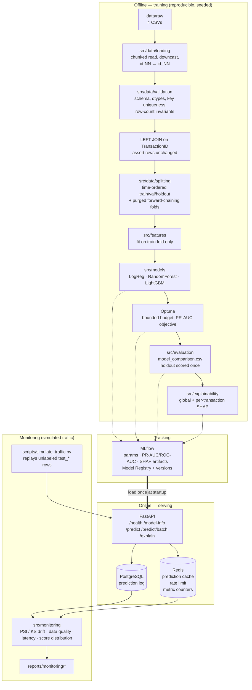

# Dataset & Architecture Audit — IEEE-CIS Fraud Detection

Every number below was measured by `scripts/inspect_dataset.py` on the actual
files in `data/raw/`. Machine-readable output: `reports/dataset_audit.json`.
Nothing here is assumed from prior knowledge of the competition.

Run to reproduce:

```bash
python scripts/inspect_dataset.py
```

---

## 1. Dataset structure

| file | size | rows | cols | full-row dups | unique `TransactionID` |
|---|---|---|---|---|---|
| `train_transaction.csv` | 651.7 MB | 590,540 | 394 | 0 | 590,540 |
| `train_identity.csv` | 25.3 MB | 144,233 | 41 | 0 | 144,233 |
| `test_transaction.csv` | 584.8 MB | 506,691 | 393 | 0 | 506,691 |
| `test_identity.csv` | 24.6 MB | 141,907 | 41 | 0 | 141,907 |

`TransactionID` is unique in all four files — no duplicate keys, no duplicate rows anywhere.

### Column families in `train_transaction.csv` (394 columns)

| family | count | missing % (min → max) | mean missing % | type |
|---|---|---|---|---|
| `V1`–`V339` | 339 | 0.002% → 86.12% | 43.04% | all numeric |
| `D1`–`D15` | 15 | 0.215% → 93.41% | 58.15% | all numeric |
| `C1`–`C14` | 14 | 0.000% → 0.000% | 0.00% | all numeric, **zero missing** |
| `M1`–`M9` | 9 | 28.68% → 59.35% | 49.92% | all categorical (`T`/`F`, `M4`∈{M0,M1,M2}) |
| `card1`–`card6` | 6 | 0.000% → 1.51% | 0.51% | 4 numeric, 2 string |
| `addr1`, `addr2` | 2 | 11.13% | 11.13% | numeric (coded, not free text) |
| `dist1`, `dist2` | 2 | 59.65% → 93.63% | 76.64% | numeric |
| `TransactionID` | 1 | 0% | — | int, sequential |
| `isFraud` | 1 | 0% | — | int {0,1} — **target** |
| `TransactionDT` | 1 | 0% | — | int, seconds offset |
| `TransactionAmt` | 1 | 0% | — | float |
| `ProductCD` | 1 | 0% | — | 5 categories (`W`,`C`,`R`,`H`,`S`) |
| `P_emaildomain` | 1 | 16.00% | — | 59 categories |
| `R_emaildomain` | 1 | 76.75% | — | 60 categories |

### `identity` files (41 columns)

`TransactionID` + `id_01`–`id_38` + `DeviceType` + `DeviceInfo`.

Notable: `id_12`, `id_15`, `id_16`, `id_23`, `id_27`, `id_28`, `id_29`,
`id_30` (OS), `id_31` (browser), `id_33` (screen resolution), `id_34`
(match_status), `id_35`–`id_38` (`T`/`F`) are **categorical**; the rest are
numeric. `DeviceType` ∈ {mobile, desktop} (2.37% missing);
`DeviceInfo` is high-cardinality free-ish text (17.73% missing,
e.g. `SAMSUNG SM-G892A Build/NRD90M`, `iOS Device`, `Windows`).

Nine identity columns are ≥96% missing: `id_07`, `id_08`, `id_21`–`id_27`.

---

## 2. Train/test structure — and why the Kaggle test set cannot be our evaluation set

Two measured facts drive the whole evaluation design:

**(a) `test_transaction.csv` has 393 columns; `train_transaction.csv` has 394.
The single difference is `isFraud`.** The Kaggle test set is unlabeled.

**(b) The split is temporal and strictly disjoint:**

| | `TransactionDT` min | max | as days |
|---|---|---|---|
| train | 86,400 | 15,811,131 | day 1 → 183 |
| test | 18,403,224 | 34,214,345 | day 213 → 396 |

Test begins ~30 days after train ends. There is no overlap.

**Consequence.** We cannot compute ROC-AUC or PR-AUC on the Kaggle test set —
there are no labels, and submitting to Kaggle is not a deployment metric. So:

- `train_*` is split **by time** into `train` / `validation` / `holdout`.
- The **holdout is the last ~20% of the training period** and is touched exactly
  once, at the end, by one model.
- `test_*` is used only as an **unlabeled production-traffic simulator** for the
  monitoring and drift components, and for train↔test covariate-shift analysis.
  That is an honest use of it, and it is what the monitoring section will say.

Measured holdout candidate (time quantile 0.80, cut at `TransactionDT` = 12,192,854 ≈ day 141):

| partition | rows | fraud rate |
|---|---|---|
| train+val (≤ cut) | 472,432 | 3.5135% |
| holdout (> cut) | 118,108 | 3.4409% |

Fraud prevalence is stable across the cut, so the holdout is representative.

### Schema mismatch that would silently corrupt the join

`train_identity.csv` uses **underscores** (`id_01` … `id_38`).
`test_identity.csv` uses **hyphens** (`id-01` … `id-38`).

All 38 columns differ in name between train and test identity files. Anything
that trains on train and scores test without renaming will see 38 all-null
columns and degrade quietly rather than crash. The loader normalizes
`id-NN → id_NN` and asserts schema equality afterwards.

Also: `V107` is **constant in test but not in train**. Caught by the profiler; it
goes on the drop list.

### A range that widens between train and test

| column | train range | test range |
|---|---|---|
| `card1` | [1000, **18396**] | [1001, **18397**] |
| `addr1` | [100, 540] | [100, 540] |
| `card2` | [100, 600] | [100, 600] |

`card1` reaches one value higher in test than anything seen in training. Trivial
in itself, but it is exactly the class of assumption that breaks a pipeline
downstream: the composite entity-key encoding packs `card1`, `addr1` and `card2`
into a single integer, and an over-strict bound derived from the training maximum
caused the test build to fail outright.

The failure was *correct behaviour from a wrong assumption*. Uniqueness of the
packed key depends only on `addr1` and `card2` occupying their positional slots
(both must be < 1000, and both max out at 540 and 600 in **both** splits);
`card1` sits in the high-order slot where its magnitude cannot cause a collision.
The guard now constrains exactly that, which is why the fix required no
retraining — every previously computed key is byte-identical.

The lesson generalises: **bounds inferred from the training split are hypotheses
about the world, not facts.** Asserting them loudly is right; asserting the wrong
one is how a pipeline becomes brittle.

---

## 3. Target column

`isFraud` in `train_transaction.csv`, binary, no missing values.

| class | count | share |
|---|---|---|
| 0 (legit) | 569,877 | 96.5007% |
| 1 (fraud) | 20,663 | **3.4993%** |

---

## 4. Transaction ↔ identity join strategy

Measured cardinality:

| | train | test |
|---|---|---|
| transaction rows | 590,540 | 506,691 |
| identity rows | 144,233 | 141,907 |
| `TransactionID` unique in both? | yes / yes | yes / yes |
| keys present in both | 144,233 | 141,907 |
| **identity coverage of transactions** | **24.42%** | **28.01%** |
| identity keys not in transactions | 0 | 0 |

The relationship is strictly **1:1**, and identity is a strict subset.

**Decision: `LEFT JOIN` transaction ← identity on `TransactionID`.**

An `INNER JOIN` would discard 75.6% of training rows. That is not merely
wasteful — identity presence is itself non-random (coverage differs 24.42% vs
28.01% between train and test), so inner-joining would bias the sample and
throw away most of the fraud signal. Row count after the join must equal the
transaction row count exactly; the pipeline asserts this.

Because identity is absent for ~3 of every 4 rows, `identity_present` becomes an
explicit binary feature rather than something the model has to infer from a wall
of nulls.

---

## 5. Missing-value analysis

No column is entirely null in any file. No constant column in train.
Missingness is **structural, not random** — it is a signal:

- `C1`–`C14`: exactly 0% missing in all 590,540 rows. Always present.
- `M1`–`M9`: ~29–59% missing, and "not provided" is a behavioural fact about the
  transaction, not a data defect.
- `dist2` (93.6%) and `D7` (93.4%) are the only train columns ≥90% missing.
- Nine identity columns ≥96% missing (`id_07/08/21/22/23/24/25/26/27`).
- `V` columns come in blocks that share an identical missing rate (e.g. `V39`–`V52`
  all 28.613% in train), which means the `V` block is composed of correlated
  sub-families that appear or vanish together.

**Handling strategy:**

- Tree models (LightGBM) get **native NaN**, not imputation. LightGBM learns a
  default direction per split; imputing a median would destroy the structural
  signal described above.
- Logistic Regression, which cannot take NaN, gets median/mode imputation **plus
  an explicit `_isna` indicator** for the columns where missingness carries
  signal — so the linear baseline is not silently handicapped.
- Missingness is preserved as features: `n_missing_per_row`,
  `identity_present`, and per-block missing indicators for `M`, `D`, `V`
  families.
- Columns ≥90% missing are **kept but flagged**, and the decision is made on
  measured validation lift rather than on the missing rate alone — a rare
  signal can still be a strong one for the minority class.

### Memory

651 MB CSV → ~1.9 GB as pandas float64. The loader downcasts to
`float32`/`int32`/`category` and persists to Parquet, cutting resident memory
roughly threefold and making reload near-instant. All profiling passes are
chunked; no stage requires holding two full copies.

---

## 6. Class imbalance analysis

3.4993% positives → **imbalance ratio 27.58 : 1**.

Fraud rate per ~30-day block (measured):

| block (30d) | rows | fraud rate |
|---|---|---|
| 0 | 130,968 | 2.4762% |
| 1 | 89,838 | 4.0373% |
| 2 | 91,768 | 4.0319% |
| 3 | 98,027 | 3.9265% |
| 4 | 85,303 | 3.4723% |
| 5 | 86,525 | 3.4013% |
| 6 | 8,111 | 4.1795% |

Prevalence is **not stationary** — it ranges 2.48%–4.18%. This matters for
threshold setting: a fixed probability threshold implies a drifting alert volume.

**Why accuracy is useless here.** Predicting "never fraud" scores 96.50%
accuracy. That is the number to beat with a constant, so accuracy is reported
nowhere in this project.

**Why ROC-AUC *and* PR-AUC, and why PR-AUC matters more.** ROC-AUC is computed
from TPR against FPR. FPR has 569,877 negatives in its denominator, so a large
absolute number of false positives moves it barely at all — ROC-AUC is
insensitive to exactly the cost that dominates fraud operations. PR-AUC uses
precision, whose denominator is the predicted-positive set, so it is directly
sensitive to how many alerts an analyst must clear per fraud caught. The
no-skill baseline also differs: ROC-AUC 0.5 regardless of prevalence, but
PR-AUC ≈ 0.035 here. A model at PR-AUC 0.60 is ~17× the trivial baseline; that
ratio is the honest statement of value. ROC-AUC is reported for comparability
with published work on this dataset; **PR-AUC is the model-selection metric.**

**Imbalance handling:** `scale_pos_weight` / `class_weight` rather than SMOTE.
Synthetic minority oversampling interpolates between fraud rows across a
434-column mostly-categorical, heavily-missing space — the interpolants are not
plausible transactions. `is_unbalance`/`scale_pos_weight` is compared against
plain training on validation PR-AUC, and probability **calibration** is applied
afterwards because the API returns a probability that feeds a risk threshold —
reweighting distorts probabilities even when it improves ranking.

---

## 7. Potential leakage risks

Ordered by how much damage they do if missed.

1. **Random K-fold across a temporal dataset.** The data spans 182 contiguous
   days and the real test set is 30 days *after* training ends. Random folds let
   the model interpolate within a time window it will never have at inference,
   producing validation scores that do not transfer. **Time-aware CV is required
   here — see §8/CV below.**
2. **Entity bleed across folds.** The same card/device transacts many times.
   Random splitting puts transactions from the same `card1`+`addr1` entity in
   both train and validation folds, so the model memorizes the entity instead of
   learning fraud. Compounds risk 1.
3. **Aggregations computed over the full dataset.** `mean(TransactionAmt)` per
   `card1` computed over all rows uses future transactions to score a past one.
   Every aggregate must be fit on the training partition only, and applied to
   validation/holdout as a lookup — or computed as past-only expanding windows.
4. **Target/mean encoding.** Any encoding using `isFraud` must be computed
   strictly inside each training fold, never on the full training set. Given
   risks 1–3, the plan is to **prefer frequency (count) encoding**, which does
   not touch the target at all, and only add target encoding if it earns its
   place with out-of-fold gains.
5. **Frequency encoding fit on train + test combined.** This is a standard
   Kaggle score-booster and it is transductive leakage: it assumes the scoring
   population is known at training time. A deployed API scores one transaction
   at a time and cannot see the future population. **Frequencies are fit on the
   training partition only.** This will cost leaderboard points and is the
   correct engineering decision — the project is a serving system, not a
   submission.
6. **`TransactionID` as a feature.** It is sequential and monotonically related
   to `TransactionDT`, so it is a disguised absolute-time index — a model can
   use it to locate the time window. **Dropped from the feature matrix**, kept
   only as the join key and the prediction-log identifier.
7. **Absolute time as a feature.** Raw `TransactionDT`, or a day index derived
   from it, cannot generalize: every test value lies outside the training range,
   so a tree simply routes all test rows into the rightmost leaf. Only
   *cyclical* (hour-of-day, day-of-week) and *relative* (deltas) time features
   are allowed.
8. **`D`-column time anchoring.** `D1`–`D15` behave like day-deltas
   (`D1` ∈ [0, 640], `D15` ∈ [−83, 879], and several go negative). If they are
   deltas from a moving reference, their raw values shift with absolute time and
   will drift between train and test. Phase 3 will test the transformation
   `Dn_anchored = day_index − Dn` and keep it only if it measurably reduces
   train↔test distribution distance. Flagged as a hypothesis to verify, not a
   fact.
9. **Measured train↔test covariate shift.** Missing rates already differ
   materially: `D13` 89.51% → 75.65%, and the entire `V39`–`V52` block 28.61% →
   15.17%. Features whose distribution shifts that much are candidates for
   removal via adversarial validation, because the model will lean on them and
   then meet a different world.
10. **`V107` constant in test, not in train.** Zero variance at scoring time;
    dropped.

---

## 8. Features that must NOT be used as inputs

**Hard exclusions:**

| feature | reason |
|---|---|
| `isFraud` | the target |
| `TransactionID` | sequential ⇒ proxy for absolute time (risk 6) |
| `TransactionDT` (raw) | absolute time, disjoint train/test ranges (risk 7) |
| `V107` | constant in test |
| any full-dataset aggregate | future information (risk 3) |
| any target encoding fit outside the fold | direct target leakage (risk 4) |
| any frequency encoding fit on test | transductive leakage (risk 5) |

**To be decided by measurement, not assumption** (documented either way):

- The 339 `V` columns are heavily redundant (identical missing patterns within
  blocks). Plan: correlation-cluster them and keep one representative per
  cluster, cutting width ~3–5× at negligible signal cost. Decided by validation
  PR-AUC, not by intuition.
- Adversarial-validation dropouts: train a classifier to separate train from
  test; features it uses most are shift-heavy and are candidate removals.
- `dist2`, `D7`, `id_07/08/21`–`27` (≥93% missing) — kept unless they fail to
  earn validation lift.

---

## 9. Recommended feature engineering

Each item states *why*, since that is the part that distinguishes engineering
from feature-count inflation.

**Amount.** `log1p(TransactionAmt)` (train mean 135.03, std 239.16, max
31,937.39 — right-skewed, and the linear baseline needs it); the decimal part of
the amount (round-number amounts behave differently from card-tested ones); and
amount as a ratio to the mean/std amount **for that card1/addr1 entity computed
on the training partition** — fraud is often anomalous relative to the account's
own history, not in absolute terms. Note the measured gap is small in isolation
(fraud mean 149.24 vs legit 134.51, median 75.00 vs 68.50), which is precisely
why the *relative* form is the one likely to carry signal.

**Time.** `hour_of_day` and `day_of_week` from `TransactionDT` modulo 86,400 /
604,800 — cyclical, so they transfer across the 30-day gap. Plus
`days_since_start` used **only** for constructing time-ordered folds and
past-only aggregates, never as a model input.

**Velocity / frequency.** Transaction count and amount sum for each
`card1`, `card1+addr1`, `DeviceInfo`, and `P_emaildomain` over trailing 1h / 24h
/ 7d windows, computed strictly from **past** rows. Card testing and account
takeover are burst behaviours; a single transaction viewed alone cannot show
that.

**Entity identity.** A composite `client_id` from `card1 + addr1 + card_bin`-like
fields to approximate an account, enabling per-entity history and per-entity
`D`-column anchoring. Cardinality and stability get validated before use.

**Email/domain.** Split `P_emaildomain` / `R_emaildomain` into provider and TLD
(`gmail`, `com`); a `P == R` match flag (a mismatch between purchaser and
recipient domain is a classic mule indicator); and a "is the domain rare" flag
via training-set frequency. 59/60 categories, 16.0%/76.8% missing — so
"missing" is its own level.

**Device.** Parse `DeviceInfo` into vendor/family (its raw form is
high-cardinality strings like `SAMSUNG SM-G892A Build/NRD90M` and would overfit
verbatim); parse `id_30` into OS family + version and `id_31` into browser
family + version; `id_33` screen resolution into width, height, and pixel count.
Version-as-a-number lets the model express "outdated client", which a
one-hot string cannot.

**Identity presence.** `identity_present` (0/1) plus `n_missing_identity_fields`
— given the measured 24.42% coverage, whether identity resolution succeeded is
one of the strongest cheap signals available.

**Missingness.** `n_missing_total` per row, and per-family missing counts for
`M`, `D`, `V`.

**Encoding.** Frequency/count encoding for high-cardinality categoricals (fit on
train partition only — risk 5), LightGBM native categoricals for low-cardinality
ones, one-hot only for the Logistic Regression baseline.

Everything is implemented as fit/transform transformers, so "fit on train only"
is enforced by the interface rather than by remembering.

---

## Cross-validation decision

**Random stratified K-fold is inappropriate for this dataset**, and the audit
gives three measured reasons rather than a stylistic preference:

1. Train and test are **strictly disjoint in time** with a ~30-day gap. Random
   CV estimates within-window interpolation; the deployment task is forward
   extrapolation. They are different problems.
2. Fraud prevalence **is not stationary** (2.48% → 4.18% across blocks), so folds
   drawn at random are not exchangeable samples from one distribution.
3. Entities recur across rows, so random folds leak entities (risk 2).

**Chosen scheme: forward-chaining time-series CV with a purge gap.** Folds are
contiguous time blocks; each trains on the past and validates on the next block;
a gap between train and validation edges purges look-back windows so trailing
aggregates cannot straddle the boundary. This mirrors the real train→test
relationship, which makes validation scores actually predictive of holdout
performance.

Every model — Logistic Regression, Random Forest, LightGBM — is scored on the
**identical fold indices**, persisted to `data/processed/` so comparisons are
reproducible and not re-randomized between runs. A random stratified CV is run
**once, as a documented experiment**, purely to quantify how optimistic it is
versus the time-aware scheme. That number is worth having in the README.

---

## 10. Proposed architecture



**Component justifications — including what gets cut.**

- **LightGBM as the primary model, and XGBoost removed.** Both are installed
  (LightGBM 4.7.0, XGBoost 3.0.5) and both would land in the same accuracy
  neighbourhood on tabular data. Running both doubles tuning cost and produces a
  second number nobody acts on. LightGBM wins on this specific data: native
  categorical handling (`ProductCD`, `card4/6`, `M*`, `id_12/15/16/…`), native
  NaN routing (essential at 43% mean missingness in the `V` block), and speed at
  590k × ~400. XGBoost is stated as a considered-and-rejected alternative, which
  is more useful than a third row in a table.
- **Random Forest is kept** as a genuine contrast — bagging vs boosting, and a
  strong non-linear model that cannot exploit NaN structurally — with capped
  depth and estimators so it finishes in reasonable time. Its documented job is
  to answer "does boosting actually earn its complexity here?"
- **Logistic Regression is kept** because a regularized linear model on imputed,
  scaled, one-hot features is the floor any complex model must clear, and it
  exposes how much of the signal is simply linear.
- **Redis earns its place three ways**, none of them decorative: (1) idempotent
  prediction caching keyed by a hash of the scored feature payload — payment
  pipelines retry, and re-scoring an identical request wastes latency for a
  deterministic answer; (2) per-key sliding-window **rate limiting**, which
  cannot be done correctly in per-worker process memory once the API scales past
  one worker; (3) in-memory **metric counters** for the monitoring endpoint, so
  scraping request/latency/validation-failure counts does not issue a Postgres
  aggregate on every poll. If a component cannot be defended this concretely it
  does not ship.
- **PostgreSQL** stores the prediction log — request id, timestamp, model
  version, probability, risk level, latency, and only the *derived* metadata
  needed for drift analysis. Raw card and identity values are deliberately not
  persisted; the log carries hashed entity keys and feature summaries instead,
  because a fraud service's own logs are a payment-data liability.
- **MLflow is used for tracking and registry only.** `mlflow models serve` is
  deliberately not used — it would duplicate the FastAPI layer while giving no
  place for Pydantic validation, Redis, the prediction log, or `/explain`. The
  API loads the model from the registry by version at startup.

---

## 11. Proposed project directory structure

Close to what you sketched, with the changes explained below.

```
fraud-detection-platform/
├── configs/
│   ├── config.yaml               # paths, seed, split ratios, feature flags
│   ├── model_lgbm.yaml           # per-model hyperparameter spaces
│   └── monitoring.yaml           # drift thresholds, reference window
├── data/
│   ├── README.md                 # how to obtain; raw data never committed
│   ├── raw/  interim/  processed/
├── docs/
│   ├── 01_dataset_audit.md       # this document
│   └── 02_leakage_analysis.md    # Phase 3 output
├── notebooks/
│   └── 01_eda.ipynb              # imports from src/, defines nothing reusable
├── src/
│   ├── utils/                    # paths.py, logging_config.py, config.py, seed.py
│   ├── data/                     # loading.py, validation.py, preprocessing.py, splitting.py
│   ├── features/                 # builders + FeaturePipeline (fit/transform)
│   ├── models/                   # estimator factories, train loop, tuning
│   ├── evaluation/               # metrics.py, compare.py, calibration.py, plots.py
│   ├── explainability/           # shap_explainer.py
│   └── monitoring/               # drift.py, data_quality.py, metrics_store.py
├── api/
│   ├── main.py  schemas.py  dependencies.py  errors.py  routers/
├── database/
│   ├── models.py  session.py  init.sql
├── scripts/
│   ├── inspect_dataset.py        # Phase 1 — written, run, output in reports/
│   ├── build_dataset.py          # raw → interim → processed
│   ├── train.py  evaluate.py  register_model.py
│   ├── simulate_traffic.py       # replays unlabeled test_* rows at the API
│   └── monitor.py
├── tests/
├── docker/                       # postgres init, mlflow image, entrypoints
├── reports/                      # dataset_audit.{json,md}, figures/, monitoring/
├── .github/workflows/ci.yml
├── Dockerfile  docker-compose.yml  .dockerignore
├── requirements.txt  pyproject.toml  .env.example  .gitignore  README.md
```

Deviations from the sketch, and why:

- **`src/utils/`** added. Path resolution, logging, config loading, and seeding
  are needed by every other package; without a shared home they get copy-pasted
  and drift. `paths.py` derives everything from the repo root (overridable via
  `FRAUD_PROJECT_ROOT`, which is how the container points at `/app`), so no
  module ever contains an absolute path.
- **`docs/`** added. The audit and the leakage analysis are deliverables in their
  own right, and the README should link to them rather than absorb them.
- **`reports/`** added, and gitignored except placeholders. Generated artifacts
  are reproducible outputs, not source.
- **`configs/` split per concern** rather than one `config.yaml`, so a tuning
  run and a monitoring run do not touch the same file.
- **`scripts/simulate_traffic.py`** added. Monitoring needs traffic; this
  project has no users. The script replays real-but-unlabeled `test_*` rows
  against the running API, which is both the honest demo and a genuine use for
  the unlabeled test set.
- **`api/routers/`** added. Five endpoints where `/explain` needs SHAP and
  `/predict/batch` needs different validation would make a single `main.py` grow
  monolithic.

---

## Verified environment

Python 3.12.4 · pandas 2.2.2 · numpy 1.26.4 · scikit-learn 1.2.2 ·
LightGBM 4.7.0 · XGBoost 3.0.5 · MLflow 3.8.1 · FastAPI 0.115.14.
`optuna` and `shap` are **not yet installed** — both are in `requirements.txt`
and must be installed before Phases 7 and 8.
